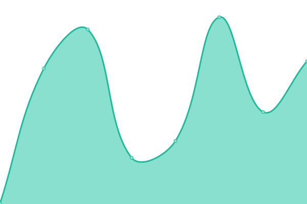
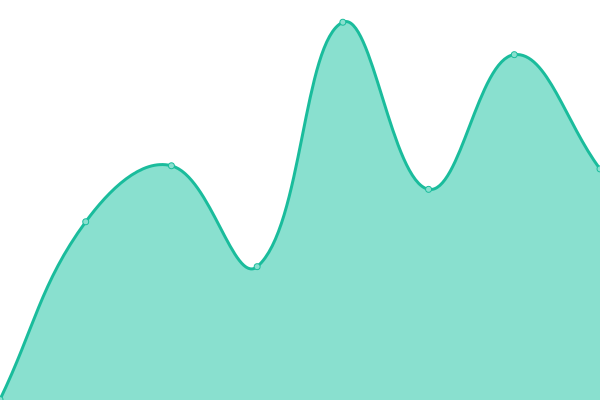

# [📈 Live Status](https://ups.andro.pw): <!--live status--> **🟧 Partial outage**

This repository contains the open-source uptime monitor and status page for [Tyler Meuse](https://ups.andro.pw), powered by [Upptime](https://github.com/upptime/upptime).

With [Upptime](https://upptime.js.org), you can get your own unlimited and free uptime monitor and status page, powered entirely by a GitHub repository. We use [Issues](https://github.com/tmeuze/uptime-monitor/issues) as incident reports, [Actions](https://github.com/tmeuze/uptime-monitor/actions) as uptime monitors, and [Pages](https://ups.andro.pw) for the status page.

<!--start: status pages-->
<!-- This summary is generated by Upptime (https://github.com/upptime/upptime) -->
<!-- Do not edit this manually, your changes will be overwritten -->
<!-- prettier-ignore -->
| URL | Status | History | Response Time | Uptime |
| --- | ------ | ------- | ------------- | ------ |
|  [Gmail](https://mail.google.com) | 🟩 Up | [gmail.yml](https://github.com/tmeuze/uptime-monitor/commits/HEAD/history/gmail.yml) | 

 200ms
     
 | 

<a href="https://ups.andro.pw/history/gmail">100.00%</a>
    

|  [GM GlobalConnect](https://www.autopartners.net/gmentsso/UI/Login) | 🟩 Up | [gm-global-connect.yml](https://github.com/tmeuze/uptime-monitor/commits/HEAD/history/gm-global-connect.yml) | 

 279ms
     
 | 

<a href="https://ups.andro.pw/history/gm-global-connect">100.00%</a>
    

|  [FMCDealer](https://www.fmcdealer.dealerconnection.com) | 🟥 Down | [fmc-dealer.yml](https://github.com/tmeuze/uptime-monitor/commits/HEAD/history/fmc-dealer.yml) | 

 492ms
     
 | 

<a href="https://ups.andro.pw/history/fmc-dealer">0.00%</a>
    

|  [Broken Site](https://thissitedoesnotexist.com) | 🟥 Down | [broken-site.yml](https://github.com/tmeuze/uptime-monitor/commits/HEAD/history/broken-site.yml) | 

 0ms
     
 | 

<a href="https://ups.andro.pw/history/broken-site">100.00%</a>
    

|  [Test for HEAD](https://www.google.com) | 🟩 Up | [test-for-head.yml](https://github.com/tmeuze/uptime-monitor/commits/HEAD/history/test-for-head.yml) | 

 40ms
     
 | 

<a href="https://ups.andro.pw/history/test-for-head">100.00%</a>
    

|  Secret Site | 🟥 Down | [secret-site.yml](https://github.com/tmeuze/uptime-monitor/commits/HEAD/history/secret-site.yml) | 

 0ms
     
 | 

<a href="https://ups.andro.pw/history/secret-site">0.00%</a>
    

<!--end: status pages-->

[**Visit our status website →**](https://ups.andro.pw)

## 📄 License

- Powered by: [Upptime](https://github.com/upptime/upptime)
- Code: [MIT](./LICENSE) © [Tyler Meuse](https://ups.andro.pw)
- Data in the `./history` directory: [Open Database License](https://opendatacommons.org/licenses/odbl/1-0/)
